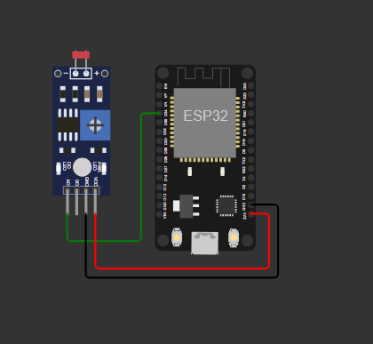

## 📌 Descrição do Projeto

Este projeto tem como objetivo demonstrar a criação e configuração de uma máquina virtual no Microsoft Azure, com a instalação de pacotes essenciais, como Docker e FIWARE. O foco é realizar requisições utilizando o Postman para interagir com a máquina virtual e enviar comandos para um dispositivo ESP32 Devkit1, controlando suas funcionalidades e testando a comunicação entre a nuvem e o dispositivo IoT.

---

## Aviso

Nosso projeto utiliza de recursos do repositório do professor Cabrini, neste link: https://github.com/fabiocabrini/fiware você pode acessar e baixar as dependências exigidas para este projeto. 

## 🛠 Passo a Passo

### 1️⃣ Escolha do Provedor de Nuvem

Optamos pelo **Microsoft Azure** como provedor de serviços em nuvem devido à sua escalabilidade, segurança e integração com diversas ferramentas.

---

### 2️⃣ Criação da Máquina Virtual no Azure

1. Acesse o portal do Azure: [portal.azure.com](https://portal.azure.com)
2. No menu, selecione **Máquinas Virtuais**.
3. Clique em **Criar** e selecione **Máquina Virtual**.
4. Configure os seguintes parâmetros:
   - **Sistema Operacional:** Escolha a distribuição Linux (Ubuntu 20.04 LTS).
   - **Requisitos da VM:** Núcleo de Processamento - 1vCPU. Memória RAM - 1GB. Armazenamento - 20GB HD e/ou  SSD
   - **Usuário e senha/Chave SSH:** Configure para acesso seguro.   
5. Conclua a criação e aguarde a disponibilização da VM.

### Abrir as portas necessárias para o projeto

**Rede:** 
Defina regras de firewall e portas necessárias (liberação das portas).

1. AllowAnySSHInbound (22/TCP) – Permite acesso remoto via SSH (risco de segurança).
2. Orion_Context_Broker (1026/TCP) – Habilita comunicação do FIWARE Orion Context Broker.
3. Eclipse-Mosquitto_MQTT (1883/TCP) – Libera o broker MQTT (comunicação IoT).
4. Iot-Agent_MQTT (4041/TCP) – Conexão do IoT Agent com o FIWARE.
5. STH-Comet (8666/TCP) – Acesso ao banco de dados histórico FIWARE.

---

### 3️⃣ Configuração da Máquina Virtual

Acesse a VM via SSH:

```sh
ssh -i /caminho/para/sua-chave.pem usuario@ip-da-maquina
```

Atualize os pacotes do sistema:

```sh
sudo apt update && sudo apt upgrade -y
```

---

### 4️⃣ Instalação dos pacotes necessários

### Instalação do Docker

Instale o Docker com os seguintes comandos:

```sh
sudo apt install docker.io -y
```

Inicie o serviço do Docker e configure para iniciar automaticamente:

```sh
sudo systemctl start docker
sudo systemctl enable docker
```

Verifique se o Docker está rodando corretamente:

```sh
docker --version
```

---

### Instalação do Git

Para clonar o repositório do projeto, instale o Git:

```sh
sudo apt install git -y
```

---

### Depêndecias para fazer o Hands-On do projeto

Para realizar o hands-on do projeto na bancada, você precisará dos seguintes itens:

- ESP32 Devkit1
- Photoresistor
- Três cabos macho-fêmea
- Você também vai ter que fazer a instalação do Arduino IDE em sua máquina, para compilar e exportar o código para o seu ESP32 Devkit1.

---

### Iniciando a máquina virtual e deixando o FIWARE ativo na nuvem.

1. Na página inicial da sua máquina virtual, clique em um botão escrito "iniciar" para que a máquina virtual comece a ligar (espere a notificação dizendo que a VM foi iniciada)

2. Com ela ligada, abra o PowerShell e digite o código com sua chave privada para acessar a sua máquina virtual. 

3. Agora conectado a sua máquina virtual, acesse o diretório home do Linux "cd ~".

4. Com o Git instalado na sua máquina virtual Linux, de um clone deste repositório: git clone https://github.com/fabiocabrini/fiware

5. Após a instalação do clone, acesse a pasta do fiware com o código "cd fiware" para entrar na pasta do projeto.

6. Se você instalou todos os pacotes corretamente, digite: sudo docker-compose up -d

7. Agora os containers irão iniciar na sua máquina virtual, assim podemos seguir para o passo a passo do Postman. 

**AVISO:** O passo a passo abaixo só irá funcionar com a máquina virtual ativa junto com os containers do Fiware.

---

### Postman

Utilize o **Postman** para enviar requisições a VM e retornar no projeto.

1. Acesse esse link: https://github.com/fabiocabrini/fiware/blob/main/FIWARE%20Descomplicado.postman_collection.json nele, faça o dowload do arquivo JSON, e exporte para o postman.

2. Com o arquivo exportado, abra as pastas e coloque o IP público da sua máquina virtual no espaço escrito "{{url}}" (Faça isso do 1. até o 10.).

3. Com o IP público posto em todos, realize os dois Health Check do projeto clicando no botão "Send". Com os Health Check funcionando, prosseguimos com o passo a passo. 


**nota** vai haver 6 colunas abaixo da url em cada arquivo, acesse a coluna "Body" e em seguida clique em "raw" para editar os códigos mostrados a baixo


4. Agora acesse o "3. Provisioning a Smart Lamp" e registre um ID novo no "device_id" (exemplo: seuid001). Também troque o "entity_name" para o nome do seu ID (Exemplo: seu_id:001). Depois de fazer isso, clique no botão Send para continuar com o projeto.

5. Acesse o "4. Registering Smart Lamp Commands" e mude o "lamp:001" para "seu_id:001", depois disso, clique em Send para concluir o registro do seu ID.

6. Agora acesse "5. List all Devices Provisioned" e clique no botão azul Send para ver se sua conta foi devidamente registrada. (a mensagem de retorno deve ser com 2 contas, a do seu registro, e a outra que já vem ao projeto, no caso o lamp001).

7. Agora registrado. Vamos para o "6. Switching on the Smart Lamp". Nesta parte é essencial a url estar escrito como "urn:ngsi-ld:lamp:001", veja se há letras maiúsculas ou minúsculas, caso tenha, pode acarretar em erro.

8. Agora é só executar os comandos "on" e "off" para que o simulador atenda os comandos.

9. Vai ter dois arquivos: "7. Result of  Smart Lamp Luminosity" e "8. Result of  Smart Lamp State". O primeiro você poderá ver a luminosidade do projeto, já a outra vai mostrar o estado da lâmpada (on e off). Lembre-se de sempre apertar o botão Send para atualizar os resultados.


**Aviso:** Caso ainda hajá dúvidas de como fazer este processo, acesse este vídeo que mostra o passo a passo citado acima: https://www.youtube.com/watch?v=8oHkAlXdWo8
---

### Simulador Wokwi

- Acesse o simulador por este link: https://wokwi.com/projects/381403531345819649
- Troque a linha 17 "default_BROKER_MQTT" para o IP público da sua máquina virtual.
- Troque também a linha 22 "default_ID_MQTT" para o o ID que você criou no postman.
- Caso a rede wifi do site da wokwi esteja lento, você pode por sua rede wifi de casa, inserindo os dados na linha 15 e na linha 16.
- Agora é só iniciar o projeto do simulador e esperar ele conectar ao wifi e ao Broker MQTT. Com os dois conectados, faça os comandos no Postman para ligar e desligar o Led. 


## ✅ Conclusão

Com esses passos, conseguimos criar e configurar uma máquina virtual no Microsoft Azure, instalar o Docker e o Fiware, junto com os pacotes essenciais, além de realizar testes com Postman para validar o funcionamento das requisições.

---

## 📌 Autores

Desenvolvido por **Vitor de Lima Domingues(RM561008), João Pedro Vieira de Morais(RM560527) e Giovanni Romano(RM560434)**.